# Alana-app

## Testing

### User Stories

**As a first time user, I want:**

   * To quickly understand the purpose of the website.

   > User can see on the homepage directly what is the website about. Under the logo name, user can read wedding dress.

   > The homepage background is a bride wearing a wedding dress.

   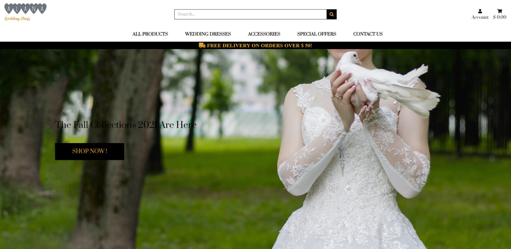

   * To navigate through the site easily and clearly.

   > The navbar menu is simple and easy to read and understand

   * To find or search for items that are related to the wedding.

   > There is a search bar on the top of the website that users can enter any key related to the wedding

    

   * Contact support for help.

   > User can contact support by e-mail or making a phone call. 

    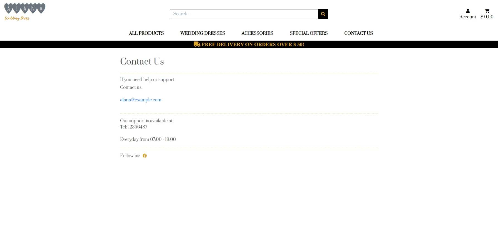

   * To do be able to shop without creating an account

   > User can make an order without registration. Sometimes it can be easily just shop and avoiding that steps. 
 

    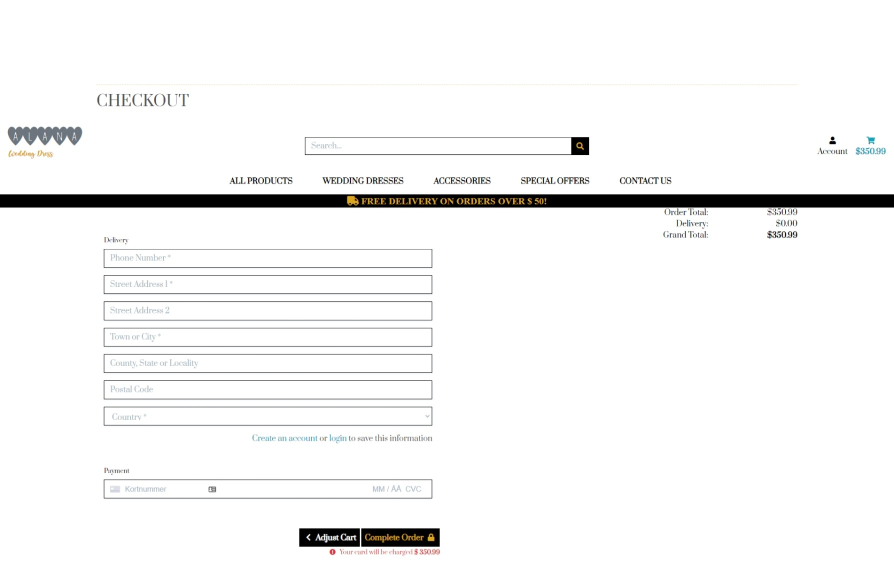

   * To be able to register an account if I want to.

  > user can sign in with the sing in the form 

 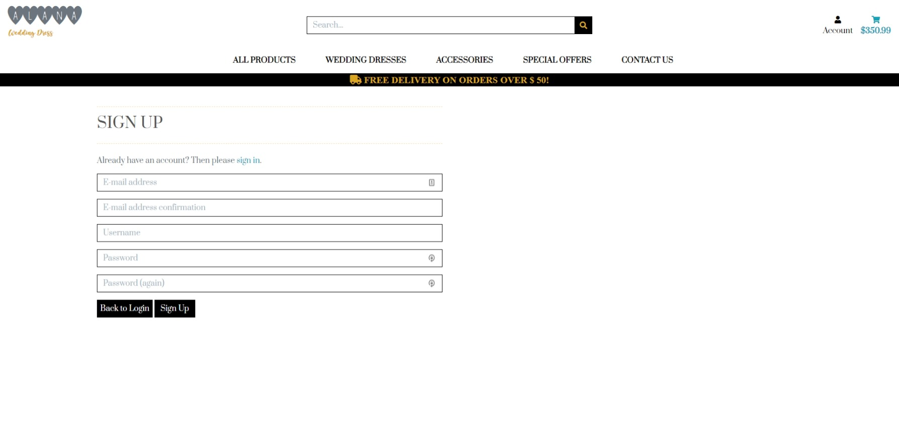

**As a returning user, I want:**

  * Navigate smoothly through the site again

  > The website was designed to navigate easily. 

  * To be able to sign in without a problem

  > It is easy to sign in, just use the signing form. 

  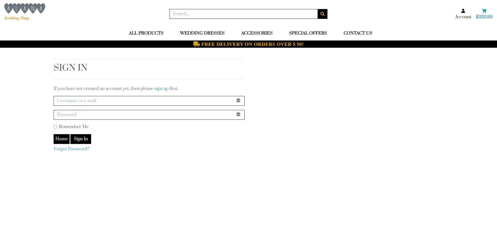

  * To be able to create a new password if I forgot it.
  
  > On the sign-in page, the user can click on the link 'Forgot you're password and provide a new password". 
  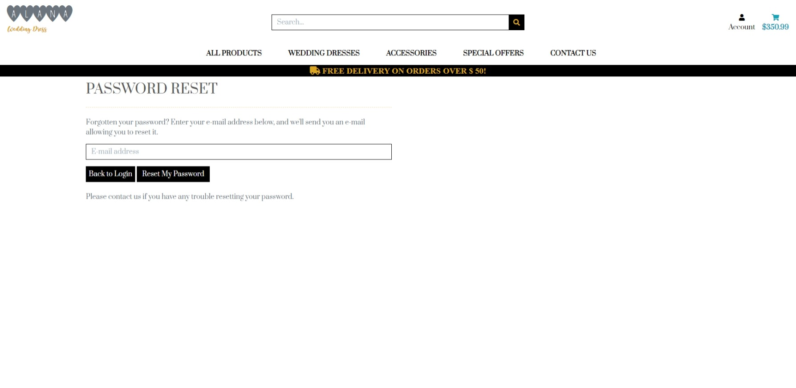

  * To find details about my previous order details.

  > An order history is available under the profile page for a user with an account. 

  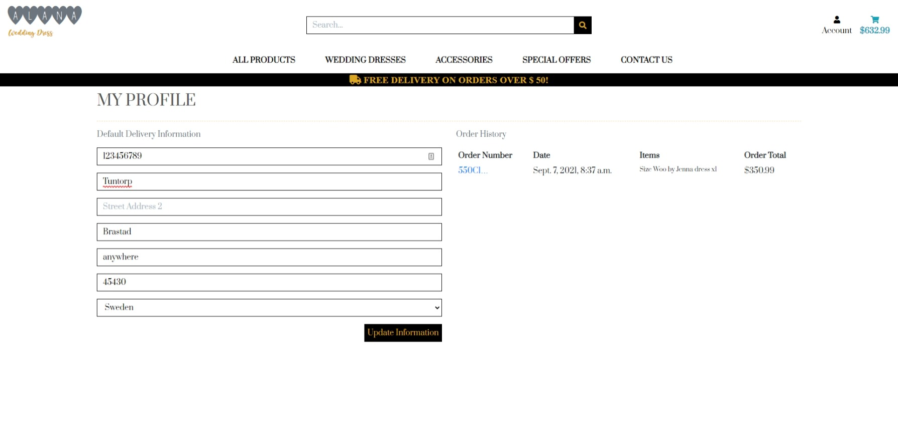

  * To find information about me on my profile and update it.

  > The user information can easily be found on the profile page"

  * Find a wedding dress or shoes with my sizes.

  > User can select the size of an item under the product detail. 

  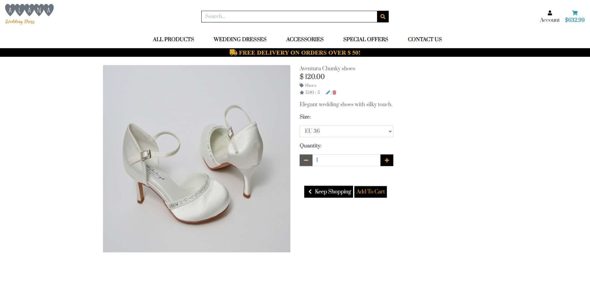

  * Search for products sorted by price, name, rating and category.
  
  > The sorting bar is applied to all products category.

  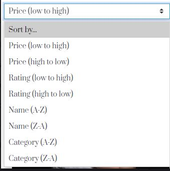

**As admin and business site owner I want to:**

  * Navigate on the site easily as all other users.
  
  > Admin can have the same experience as users.

  * Add and delete items.

  > Admin can use the Product Management form to add a product

  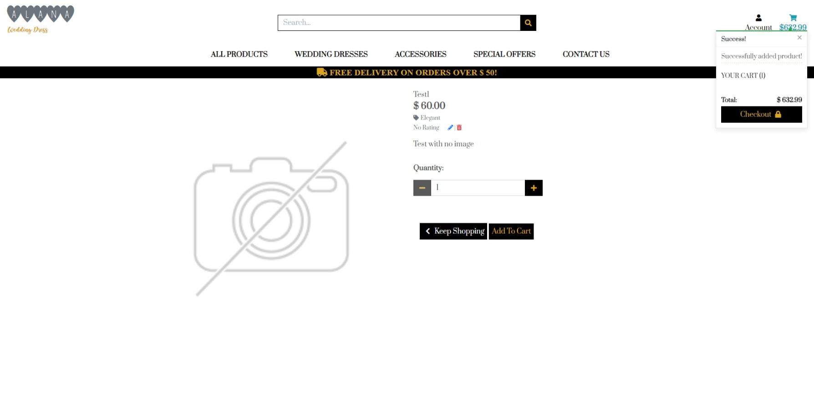

  Delete

  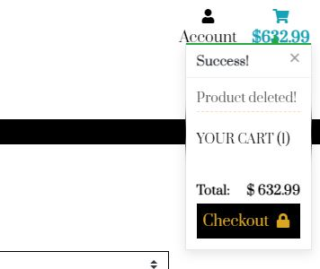

  * Manage Category

  > Admin can add and remove a category from the Django administration account.

  *  Update products description and price.

  > With the edit button, the admin can update any product without a problem.

  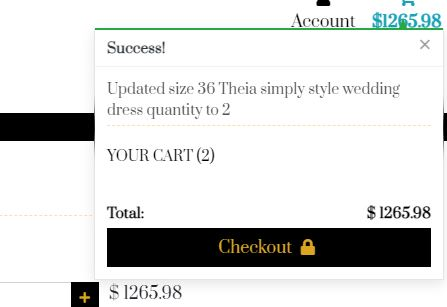

  * Make sure that it is only me who can manage the products item.

  > If a user attempts to do anything that they have permission for, a warning toast message comes up.

  * Access orders details for the shopper.

  > A mail confirmation will be sent to the user with their order details. 

  * Make sure that the user can contact me for help or other information.

  > Contact information is available under the Contact Us page. 

  ## Functionality testing

* The navbar stays fixed on the top of the pages on all devices.  

* The delivery banner stays fixed on the top of all the pages. 

* All internal links are tested and working

* Error page 404, 500 are tested and working. 

* The mail address and phone number are not working. It is only for test. 

* Users and admin can log in with their username and password. 

* User and admin can sign out.

* New users can registred a new account.

*  A confirmation e-mail is working by a new user.

* Confirmation of orders are sent to the users' mail

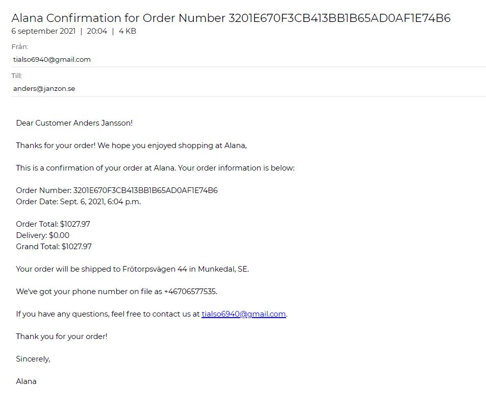

* The demo credit card number is working. 

* According to CRUD user can:

 *  Create order and an account

 > Confirmation e-mail from a user

 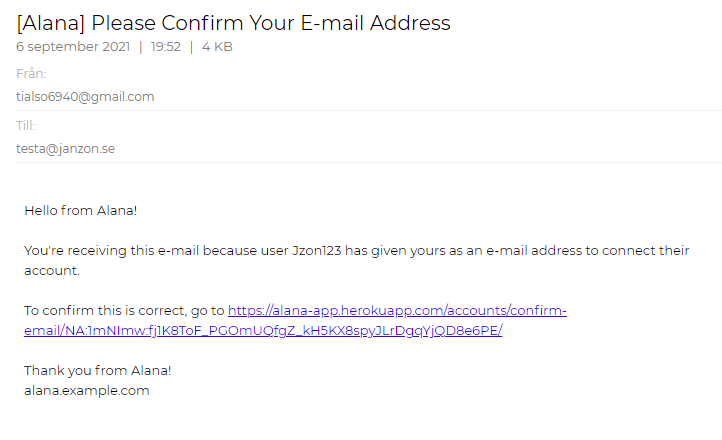

 * Can update and delete item from shopping cart

 > Can update and delete the item from the shopping cart

 Image before editing: 

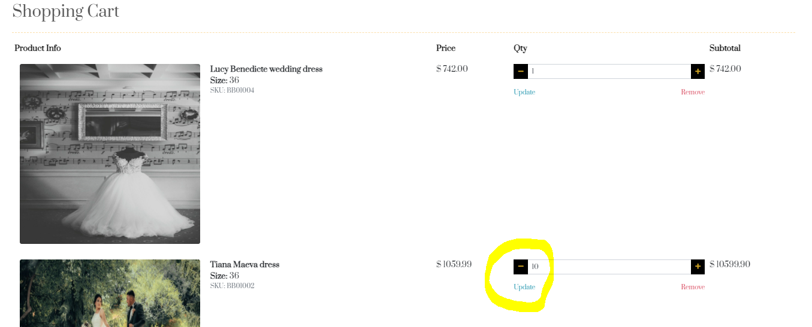

After editing: 

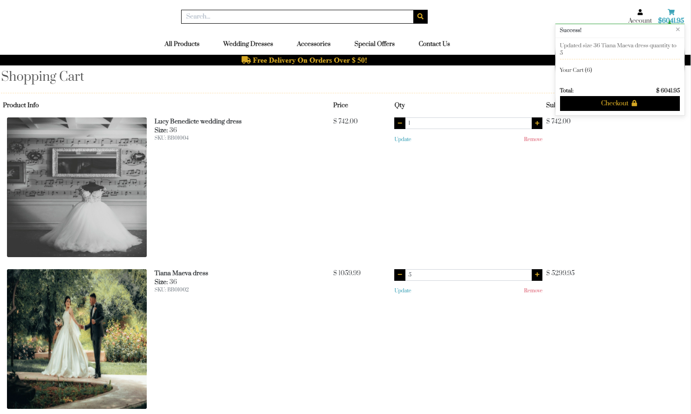

 * User can update their profile

 > In this example, the user update his street address from Frotorspvagen 44 to Snomosgatan 666

Before: 

 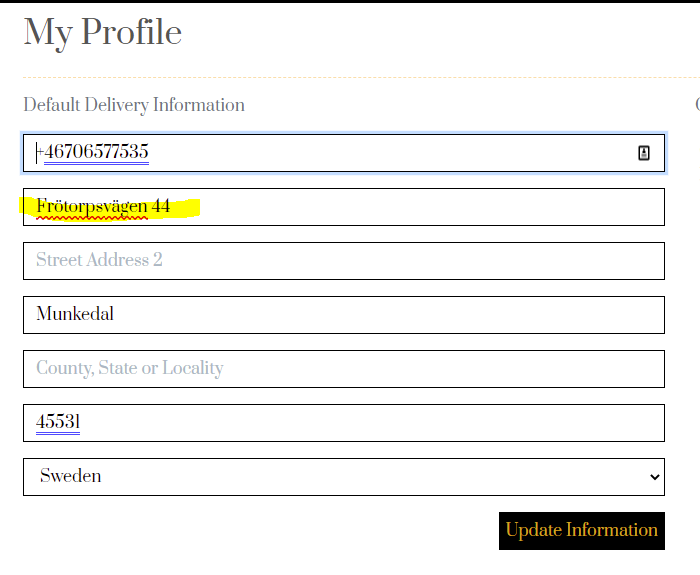

After:

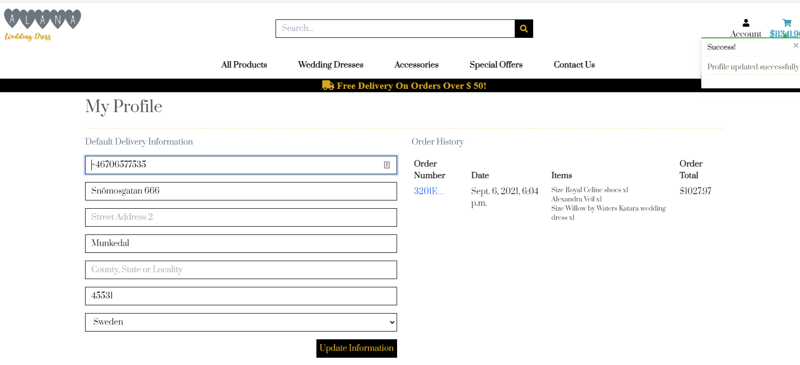

 * Admin can add and delete the product from Django administration and on the site.

 >  I tested uplod an no image product on the site. 

### Validation

All HTML document were formatted. 

[HMTL](https://validator.w3.org/) validate from the direct input.

* Home

> No error 

* Cart

> No error

* Product

> No error 

* Profiles

> No error

* Base.html

> No error 

 [CSS](https://jigsaw.w3.org/css-validator/) validate from the direct input.

 * base.css

 > No error

[Javascript](https://jshint.com/)

>No error

# Stripe webhook

* Communicatiom between the app and webhook works perfectly. See latest result from stripe

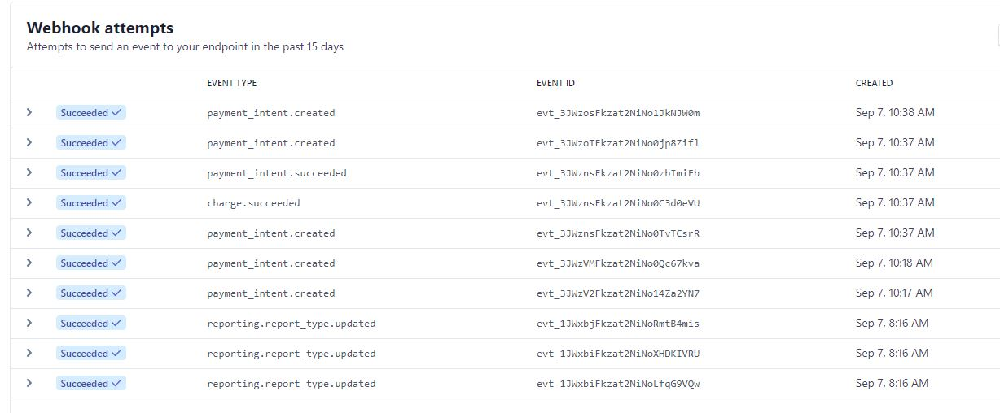

# Responsiveness

* Motorola
* Iphone 7
* MSI LAPTOP
* HP Laptop

## Browser compability

* The site war running by following browser: 
1. Chrome
1. Edge
1. Opera
1. Firefox

# Performance testing

